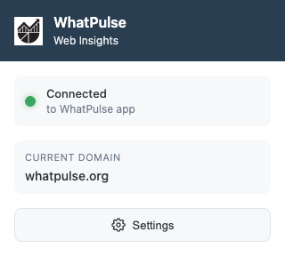

# WhatPulse Web Insights Browser Extension

A unified browser extension that connects to the WhatPulse desktop client via WebSocket to enable website time insights.



## Architecture

The extension uses a **local WebSocket connection** to communicate with the WhatPulse client running on the same machine. It monitors active tabs and sends domain usage information when conditions are met.

## Project structure

```
├── background/             # Background service worker
│   └── background.js
├── popup/                  # Extension popup UI
│   ├── popup.html
│   ├── popup.js
│   └── popup.css
├── options/                # Options page
│   ├── options.html
│   ├── options.js
│   └── options.css
├── icons/                  # Extension icons (16, 32, 48, 128, 400px)
├── content.js              # Content script for input tracking
├── manifest.json           # Active manifest (copy of browser-specific manifest)
├── manifest-chrome.json    # Chrome/Chromium manifest
├── manifest-firefox.json   # Firefox manifest
├── manifest-safari.json    # Safari manifest
├── switch-target.sh        # Script to switch between browser targets
└── release.sh              # Script to create a new release
```

## Supported browsers

- **Chromium-based**: Chrome, Edge, Brave, Opera, Vivaldi, Arc, Yandex, Samsung Internet
- **Firefox**: Firefox and Firefox-based browsers
- **Safari**: macOS Safari (requires native messaging)

## Security & Privacy

- **Local-only**: Extensions only connect to `ws://127.0.0.1:<port>` (localhost)
- **Domain-only tracking**: Only eTLD+1 domains are sent, never full URLs
- **No history storage**: Extensions don't store any browsing data
- **Explicit opt-in**: Users must install the extension and approve pairing
- **Private browsing**: No data is sent for private/incognito windows

For full details, see the [WhatPulse Privacy Policy](https://whatpulse.org/privacy).

## Installation

### Development installation

#### Chromium (Chrome, Edge, Brave)

1. Switch to the Chrome manifest:
   ```bash
   ./switch-target.sh chrome
   ```
2. Open `chrome://extensions/` (or `edge://extensions/` for Edge)
3. Enable "Developer mode"
4. Click "Load unpacked"
5. Select this directory
6. Click the extension icon - the extension will request pairing with WhatPulse
7. Approve the pairing request in the WhatPulse client

#### Firefox

1. Switch to the Firefox manifest:
   ```bash
   ./switch-target.sh firefox
   ```
2. Open `about:debugging#/runtime/this-firefox`
3. Click "Load Temporary Add-on"
4. Select the `manifest.json` file
5. Click the extension icon - the extension will request pairing with WhatPulse
6. Approve the pairing request in the WhatPulse client

#### Safari

1. Switch to the Safari manifest:
   ```bash
   ./switch-target.sh safari
   ```
2. Safari extensions require additional setup through Xcode and the Safari Extension Builder
3. Native messaging must be configured for Safari support

## Authentication Flow

The extension uses a **pairing-based authentication** system:

### Initial Pairing (First Connection)

1. Extension connects to WebSocket and sends `hello` message **without** `auth_token`
2. WhatPulse client emits `pairingRequested` signal, showing UI notification to user
3. User approves pairing in WhatPulse client
4. Server sends `pairing_approved` message containing the `auth_token`
5. Extension stores `auth_token` in browser storage for future connections

### Subsequent Connections

1. Extension connects and sends `hello` message **with** stored `auth_token`
2. Server validates token and responds with `hello_ack`
3. Normal message exchange begins

### Authentication Failure

If the `auth_token` is invalid or expired, the server sends an `error` message with code `AUTH_FAILED` and closes the connection. The extension should clear its stored token and restart the pairing flow.

## Message Protocol

All messages are JSON objects with the following common fields:

| Field | Type | Description |
|-------|------|-------------|
| `schema_version` | int | Protocol version (currently `1`) |
| `type` | string | Message type |
| `ts` | int64 | Timestamp (UNIX epoch milliseconds) |
| `client_id` | string | Stable UUID per extension install |

### Message Types

#### `hello` (Extension → Server)

Initial handshake message.

```json
{
  "schema_version": 1,
  "type": "hello",
  "ts": 1704067200000,
  "client_id": "550e8400-e29b-41d4-a716-446655440000",
  "auth_token": "abc123...",
  "browser": {
    "name": "chrome",
    "version": "120.0.6099.109"
  },
  "capabilities": ["activeTab", "visibility", "url", "usageReport"],
  "ext_version": "1.0.0"
}
```

- Omit `auth_token` for initial pairing request
- `capabilities`: Features the extension supports (e.g., `activeTab`, `visibility`, `url`, `usageReport`)
- `browser.name`: Detected browser name (e.g., `chrome`, `edge`, `brave`, `firefox`, `safari`, `opera`, `vivaldi`, `arc`, `yandex`, `samsung`)

#### `hello_ack` (Server → Extension)

Successful authentication response.

```json
{
  "schema_version": 1,
  "type": "hello_ack",
  "ts": 1704067200000,
  "server_time": 1704067200500,
  "session_token": "session-xyz-789"
}
```

#### `pairing_approved` (Server → Extension)

Sent after user approves pairing request.

```json
{
  "schema_version": 1,
  "type": "pairing_approved",
  "ts": 1704067200000,
  "auth_token": "new-auth-token-abc123"
}
```

Extension should store this `auth_token` for future connections.

#### `focus` (Extension → Server)

Tab focus state changed.

```json
{
  "schema_version": 1,
  "type": "focus",
  "ts": 1704067200000,
  "client_id": "...",
  "tab_id": "123",
  "is_focused": true
}
```

#### `visibility` (Extension → Server)

Tab visibility state changed.

```json
{
  "schema_version": 1,
  "type": "visibility",
  "ts": 1704067200000,
  "client_id": "...",
  "tab_id": "123",
  "is_visible": true
}
```

#### `active_domain` (Extension → Server)

User navigated to a new domain.

```json
{
  "schema_version": 1,
  "type": "active_domain",
  "ts": 1704067200000,
  "client_id": "...",
  "domain": "github.com",
  "window_id": "1",
  "tab_id": "123"
}
```

#### `heartbeat` (Extension → Server)

Periodic keepalive with current state. Currently not used - the extension uses `usage_report` instead.

```json
{
  "schema_version": 1,
  "type": "heartbeat",
  "ts": 1704067200000,
  "client_id": "...",
  "domain": "github.com",
  "is_focused": true,
  "is_visible": true,
  "interval_ms": 1000
}
```

#### `usage_report` (Extension → Server)

Accumulated time and input stats per domain. Sent every 30 seconds.

```json
{
  "schema_version": 1,
  "type": "usage_report",
  "ts": 1704067200000,
  "client_id": "...",
  "period_start": 1704060000000,
  "period_end": 1704067200000,
  "report": [
    {
      "domain": "github.com",
      "seconds": 25,
      "keys": 150,
      "clicks": 30,
      "scrolls": 42,
      "mouse_distance_in": 12.5
    },
    {
      "domain": "youtube.com",
      "seconds": 10,
      "keys": 0,
      "clicks": 5,
      "scrolls": 15,
      "mouse_distance_in": 3.2
    }
  ]
}
```

**Validation limits**: Max 35 seconds per domain, max 35 seconds total per report (matches ~30s reporting interval).

#### `metadata_update` (Extension → Server)

Domain metadata (favicon URLs) from extension.

```json
{
  "schema_version": 1,
  "type": "metadata_update",
  "ts": 1704067200000,
  "client_id": "...",
  "domain": "github.com",
  "favicon_urls": [
    "https://github.com/favicon.ico",
    "https://github.githubassets.com/favicons/favicon.svg"
  ]
}
```

#### `goodbye` (Extension → Server)

Clean disconnect notification.

```json
{
  "schema_version": 1,
  "type": "goodbye",
  "ts": 1704067200000,
  "client_id": "...",
  "reason": "extension_disabled"
}
```

#### `error` (Server → Extension)

Error response.

```json
{
  "schema_version": 1,
  "type": "error",
  "ts": 1704067200000,
  "error_code": "AUTH_FAILED",
  "reason": "Invalid authentication token"
}
```

Error codes:
- `AUTH_FAILED`: Invalid or expired auth token
- `INVALID_MESSAGE`: Malformed message
- `RATE_LIMITED`: Too many messages

## Development

### Testing the WebSocket Connection

You can test the connection using the browser console:

```javascript
// Pairing request (no auth token)
const ws = new WebSocket('ws://127.0.0.1:3488');
ws.onopen = () => {
  ws.send(JSON.stringify({
    schema_version: 1,
    type: 'hello',
    ts: Date.now(),
    client_id: 'test-client-' + Math.random().toString(36).substr(2, 9),
    browser: { name: 'chrome', version: '120.0' },
    capabilities: ['activeTab', 'visibility'],
    ext_version: '1.0.0'
  }));
};
ws.onmessage = (event) => {
  const msg = JSON.parse(event.data);
  console.log('Received:', msg);
  if (msg.type === 'pairing_approved') {
    console.log('Save this auth_token:', msg.auth_token);
  }
};
```

```javascript
// Authenticated connection (with auth token)
const ws = new WebSocket('ws://127.0.0.1:3488');
ws.onopen = () => {
  ws.send(JSON.stringify({
    schema_version: 1,
    type: 'hello',
    ts: Date.now(),
    auth_token: 'YOUR_SAVED_TOKEN_HERE',
    client_id: 'test-client-abc123',
    browser: { name: 'chrome', version: '120.0' },
    capabilities: ['activeTab', 'visibility'],
    ext_version: '1.0.0'
  }));
};
ws.onmessage = (event) => console.log('Received:', event.data);
```

## Configuration

The extension stores configuration in browser local storage:

- `clientId`: Stable UUID for this extension install
- `authToken`: Authentication token (received from pairing)
- `enabled`: Feature toggle (default: true)
- `metadataSentTimes`: Cache of when favicons were last sent per domain

The WebSocket port is fixed at `3488` and must match the WhatPulse desktop client.

## Releasing a new version

Use the `release.sh` script to create a new release:

```bash
./release.sh 1.0.0
```

To repackage an existing version (overwrites the tag):

```bash
./release.sh 1.0.0 --force
```

This script:
1. Updates the version in all `manifest-*.json` files
2. Commits the version change
3. Creates a git tag (e.g., `v1.0.0`)
4. Pushes to main and the release branch
5. Triggers the GitHub Actions build workflow

The GitHub Actions workflow then:
1. Builds extensions for Chrome and Firefox
2. Uploads to R2 storage
3. Sends a Discord notification

Release artifacts are available at:
- `https://releases-dev.whatpulse.org/browser-extensions/v{version}-chrome-extension.zip`
- `https://releases-dev.whatpulse.org/browser-extensions/v{version}-firefox-extension.zip`

For browser store releases, extensions should be packaged and signed through the respective browser stores.
